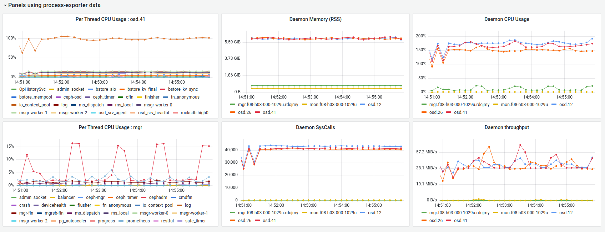

# process-exporter
This project uses procfs stats to export process and optionally thread level usage information to Prometheus.

## Usage

```
Usage of ./process-exporter:
  -debug
        run in debug mode (default true)
  -filter string
        command of the process to search for (can be a comma separated list)
  -nomatch-abort
        shutdown if the filter doesn't match any active process
  -port int
        port for the exporter to bind to (default 9200)
  -prefix string
        prefix to use for the metric names returned to Prometheus (default "proc")
  -with-threads
        include thread cpu stats for processes that match the filter 
```

Although the ```-with-threads option``` is useful for diagnostics, if you're monitoring many processes that use high numbers of threads, you should consider the cardinality impact to the Prometheus Server before enabling. If your unsure how many threads your processes are using, you can use the  ```*_process_thread_total``` metric to help determine the impact of enabling thread collection.

## Metrics Example
The metrics below show the format returned when running the exporter within a Ceph cluster
```
# HELP ceph_process_cpu_kernel_seconds_total Kernel CPU usage of process          
# TYPE ceph_process_cpu_kernel_seconds_total counter                   
ceph_process_cpu_kernel_seconds_total{daemon="mgr.f08-h03-000-1029u.rdcjmy",pid="2429884",pname="ceph-mgr"} 152260
ceph_process_cpu_kernel_seconds_total{daemon="mon.f08-h03-000-1029u",pid="2429525",pname="ceph-mon"} 36879 
ceph_process_cpu_kernel_seconds_total{daemon="osd.12",pid="2453229",pname="ceph-osd"} 9.003454e+06 
ceph_process_cpu_kernel_seconds_total{daemon="osd.26",pid="2454658",pname="ceph-osd"} 8.438128e+06 
ceph_process_cpu_kernel_seconds_total{daemon="osd.41",pid="2456066",pname="ceph-osd"} 8.720879e+06 
# HELP ceph_process_cpu_user_seconds_total User CPU usage of process
# TYPE ceph_process_cpu_user_seconds_total counter
ceph_process_cpu_user_seconds_total{daemon="mgr.f08-h03-000-1029u.rdcjmy",pid="2429884",pname="ceph-mgr"} 2.112666e+06      
ceph_process_cpu_user_seconds_total{daemon="mon.f08-h03-000-1029u",pid="2429525",pname="ceph-mon"} 141344         
ceph_process_cpu_user_seconds_total{daemon="osd.12",pid="2453229",pname="ceph-osd"} 2.2370442e+07                
ceph_process_cpu_user_seconds_total{daemon="osd.26",pid="2454658",pname="ceph-osd"} 1.8780371e+07                
ceph_process_cpu_user_seconds_total{daemon="osd.41",pid="2456066",pname="ceph-osd"} 2.085986e+07                 
# HELP ceph_process_read_bytes_total Process read bytes completed
# TYPE ceph_process_read_bytes_total counter
ceph_process_read_bytes_total{daemon="mgr.f08-h03-000-1029u.rdcjmy",pid="2429884",pname="ceph-mgr"} 831488      
ceph_process_read_bytes_total{daemon="mon.f08-h03-000-1029u",pid="2429525",pname="ceph-mon"} 7.82336e+07               
ceph_process_read_bytes_total{daemon="osd.12",pid="2453229",pname="ceph-osd"} 3.59511560192e+12
ceph_process_read_bytes_total{daemon="osd.26",pid="2454658",pname="ceph-osd"} 3.291854794752e+12
ceph_process_read_bytes_total{daemon="osd.41",pid="2456066",pname="ceph-osd"} 3.319712362496e+12           
# HELP ceph_process_rss_size_bytes Memory consumed by the process (Resident Set Size)
# TYPE ceph_process_rss_size_bytes gauge
ceph_process_rss_size_bytes{daemon="mgr.f08-h03-000-1029u.rdcjmy",pid="2429884",pname="ceph-mgr"} 8.0
ceph_process_rss_size_bytes{daemon="mon.f08-h03-000-1029u",pid="2429525",pname="ceph-mon"
ceph_process_rss_size_bytes{daemon="osd.12",pid="2453229",pname="ceph-osd"} 6.416355328e+09 ceph_process_rss_size_bytes{daemon="osd.26",pid="2454658",pname="ceph-osd"} 6.602391552e+09 
ceph_process_rss_size_bytes{daemon="osd.41",pid="2456066",pname="ceph-osd"} 6.569611264e+09 
# HELP ceph_process_syscall_reads_the process
# TYPE ceph_process_syscall_reads_total counter
ceph_process_syscall_reads_total{daemon="mgr.f08-h03-000-1029u.rdcjmy",pid="2429884",pname="ceph-mgr"} 1.8353412e+07  
ceph_process_syscall_reads_total{daemon="mon.f08-h03-000-1029u",pid="2429525",pname="ceph-mon"} 3.1571806e+07  
ceph_process_syscall_reads_total{daemon="osd.12",pid="2453229",pname="ceph-osd"} 6.355930948e+09
ceph_process_syscall_reads_total{daemon="osd.26",pid="2454658",pname="ceph-osd"} 5.993896082e+09
ceph_process_syscall_reads_total{daemon="osd.41",pid="2456066",pname="ceph-osd"} 6.101068545e+09
# HELP ceph_process_thread_total Total threads associated with the process
# TYPE ceph_process_thread_total gauge
ceph_process_thread_total{daemon="mgr.f08-h03-000-1029u.rdcjmy",pid="2429884",pname="ceph-mgr"} 311
ceph_process_thread_total{daemon="mon.f08-h03-000-1029u",pid="2429525",pname="ceph-mon"} 25
ceph_process_thread_total{daemon="osd.12",pid="2453229",pname="ceph-osd"} 68
ceph_process_thread_total{daemon="osd.26",pid="2454658",pname="ceph-osd"} 68
ceph_process_thread_total{daemon="osd.41",pid="2456066",pname="ceph-osd"} 68
# HELP ceph_process_written_bytes_total Process write bytes completed
# TYPE ceph_process_written_bytes_total counter
ceph_process_written_bytes_total{daemon="mgr.f08-h03-000-1029u.rdcjmy",pid="2429884",pname="ceph-mgr"} 6.656e+06
ceph_process_written_bytes_total{daemon="mon.f08-h03-000-1029u",pid="2429525",pname="ceph-mon"} 3.518347264e+10
ceph_process_written_bytes_total{daemon="osd.12",pid="2453229",pname="ceph-osd"} 8.299707850752e+12
ceph_process_written_bytes_total{daemon="osd.26",pid="2454658",pname="ceph-osd"} 8.040501243904e+12
ceph_process_written_bytes_total{daemon="osd.41",pid="2456066",pname="ceph-osd"} 8.424020615168e+12
```

## Building the container
Install podman and buildah on your machine and then run the ```buildah/build-exporter.sh``` script.

If you're not interested in the code, and just want to deploy it to kick the types, you can grab the latest container from [docker hub](https://hub.docker.com/r/pcuzner/process-exporter).


## Running the container
Once you've built the container locally, you can test it like this (assumes you built it with a *test* tag);  
```
podman run -d --network=host --name proctest -v /proc:/host/proc:ro --user 65534 localhost/process-exporter:test -debug -filter=kwin_x11
```

Here's an example looking at ceph osd and mgr processes, using the prebuilt container
  
```
podman run -d --rm --network=host --name proc-exporter -v /proc:/host/proc:ro --user 65534 docker.io/pcuzner/process-exporter:latest -debug -filter=ceph-osd,ceph-mgr -with-threads -prefix=ceph
```

## Visualisations
The process-exporter code has been used to gain insights into Ceph OSD performance with Grafana. The screenshot below gives an odea of the kind of views you can create.  



This dashboard is provided in the [examples](examples/grafana/process-exporter%20example%20dashboard%20-%20ceph.json) directory

## TO-DO
[ ]  provide a custom container service definition for Ceph  

 